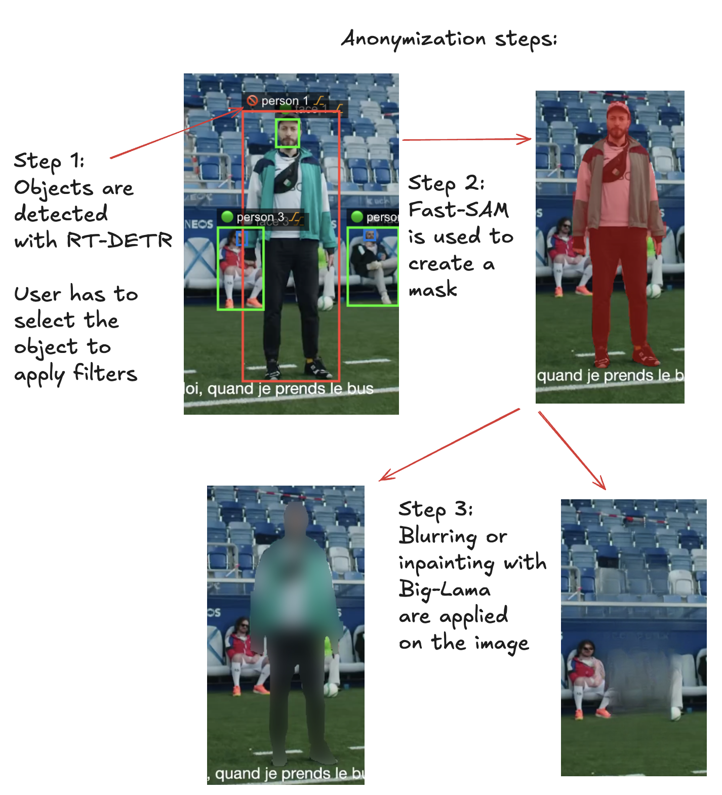

# 🛡️ Samantha – A Video Anonymization Tool for Education 

**CAS Applied Data Science 2024 – Final Project**  

**University of Bern & HEP Vaud**

**marcel.grosjean@hepl.ch**


**Samantha** is a privacy-preserving video anonymization app designed specifically for educators and researchers. It enables the secure use of classroom video data while complying with strict legal and ethical standards. 

This anonymization software was developed at the University of Teacher Education, Vaud (HEP Vaud), to facilitate the ethical and secure handling of sensitive data used in research and educational projects. It enables the automatic anonymization of video files by removing or pseudonymizing personally identifiable information, while ensuring traceability and reproducibility of the applied processes.

Designed to meet the specific needs of the academic environment, the tool emphasizes ease of use, process transparency, and compliance with current ethical and legal standards, including data protection regulations (GDPR, Swiss FADP).

The development of this software is part of a broader commitment to responsible research and open knowledge sharing, offering a free, adaptable, and sustainable solution to the educational community.

This project was developed as part of the final project in the **Certificate of Advanced Studies in Applied Data Science (CAS-ADS)**.

## 📄 Final Report

The detailed project report — including model training, architecture, anonymization pipeline, evaluation, and references — is available in the [`/report/final_report.pdf`](./report/final_report.pdf) folder.

---

## 🎥 Demo

This is a demo of the global workflow:


#### Anonymization process

The anonymization process in Samantha involves several key steps. First, the app detects all relevant objects in each video frame using two RT-DETR models—one for general objects and one specifically trained for faces. All the objects are tracked across frames with ByteTrack. The user then manually selects which detected objects to anonymize. For each selected object, the system applies a segmentation mask using FastSAM-X, and then either blurs the region or inpaints it using Big-Lama to remove identifiable information. Finally, the anonymized frames are reassembled into a processed video.




---

## 📁 Repository Structure

```
📦 Samantha/
 ┣ 📂 Samantha/           → Full anonymization app
 ┃ ┗ 📂 src-pytjon/       → Python backend with detection, tracking, anonymization logic
 ┣ 📂 RT-DETR-Face/       → Trained face detection model (RT-DETR-X on WIDER Face)
 ┃ ┣ 📄 train-RT-DETR-X-Face.ipynb → Training notebook
 ┃ ┣ 📄 wider.yaml        → Dataset config
 ┃ ┗ 📄 *.py              → Annotation converters and helpers
 ┣ 📂 report/             → Final written report and resources
 ┃ ┣ 📄 final_report.pdf  → Complete PDF report
 ┃ ┗ 📄 steps.gif         → Demo animation of the full pipeline
 ┗ 📄 README.md           → Project overview and usage
```

---

## 🎯 Project Goals

- Allow teachers and researchers to **anonymize faces and objects** in educational videos.
- Use **deep learning models** (RT-DETR-X, FastSAM-X, Big-Lama) optimized for both **Apple Silicon and CUDA GPUs**.
- Provide a **user-friendly, cross-platform application** for non-technical users.

---

## ⚙️ Technologies Used

| Component        | Tech Stack                                |
|------------------|--------------------------------------------|
| Frontend         | Vue.js (Quasar), Electron, TypeScript      |
| Backend          | Python, PyTorch, OpenCV, ffmpeg            |
| Models           | RT-DETR-X, FastSAM-X, Big-Lama             |
| Hardware Support | Apple Silicon, CUDA                        |

---

## 🧠 Deep Learning Models

- 🟠 **RT-DETR-X** – real-time transformer model for object detection  
- 🟡 **RT-DETR-Face** – fine-tuned on WIDER Face dataset for high-accuracy face detection  
- 🔵 **FastSAM-X** – segment-anything model for object masking  
- 🔴 **Big-Lama** – inpainting model to erase sensitive content

All models are chosen for **speed, accuracy, and Apple Silicon compatibility**.

---

## 🧪 Current Status

- ✅ Detection pipeline works reliably for most educational videos  
- ✅ UI is fully functional and tested with real users  
- ⚠️ Anonymization (especially inpainting) can be slow  
- ⚠️ Tracking and mask precision still have limitations  
- ⚠️ App is **not yet ready for deployment**, still in development  

Final release goals:
- One-click installers for **Windows, macOS, and Linux**
- Better tracking & inpainting accuracy
- Manual annotation tools for full control

---

## 📜 License

This project is licensed under the **MIT License**.  
Feel free to fork, contribute, or adapt for your educational or research use.

---

> Developed with care at the University of Teacher Education, Vaud (HEP Vaud) & the University of Bern, 2024.