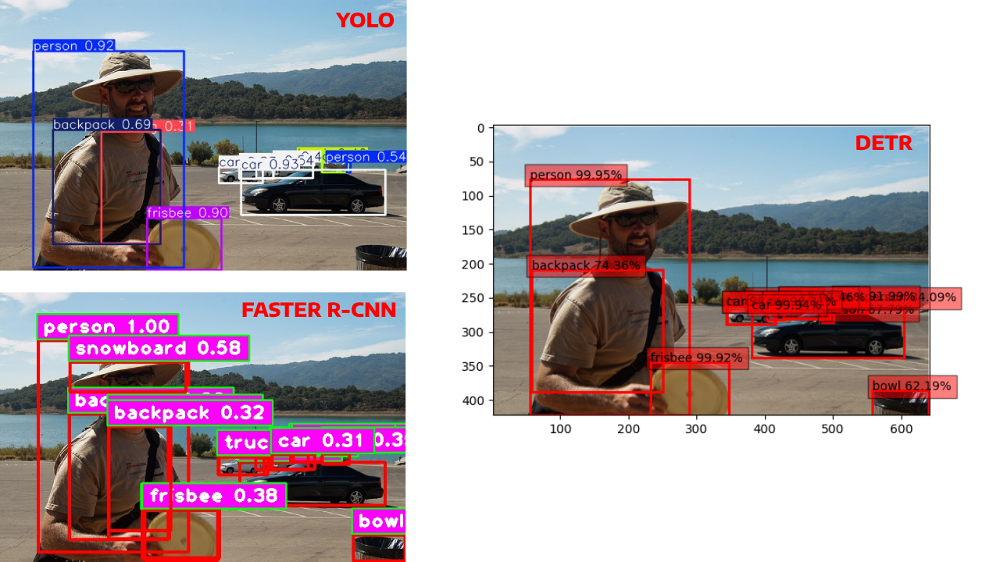
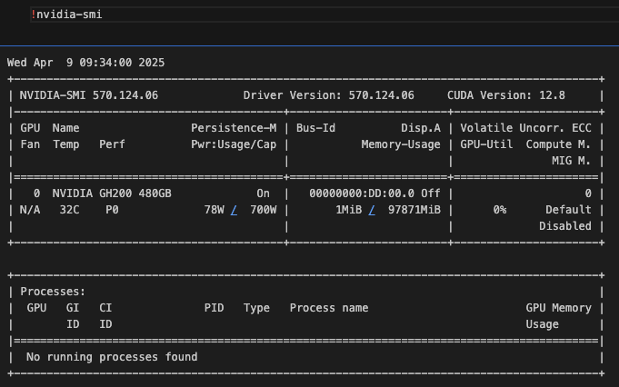
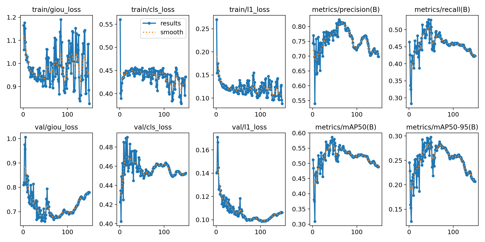
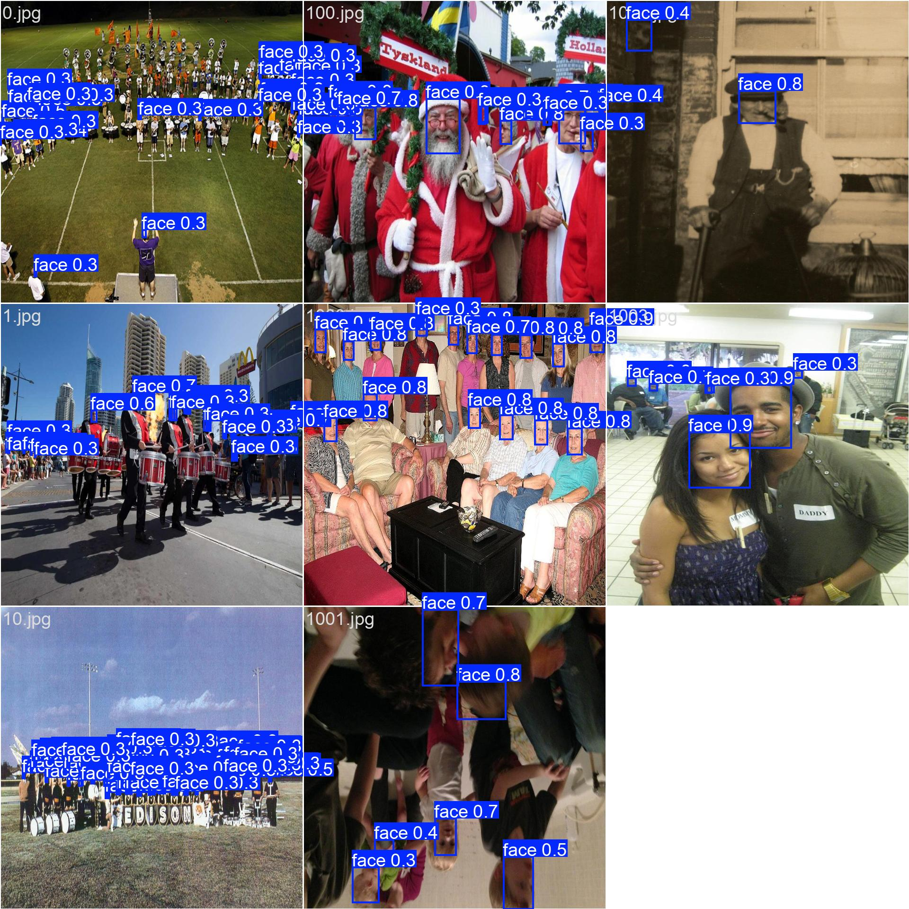
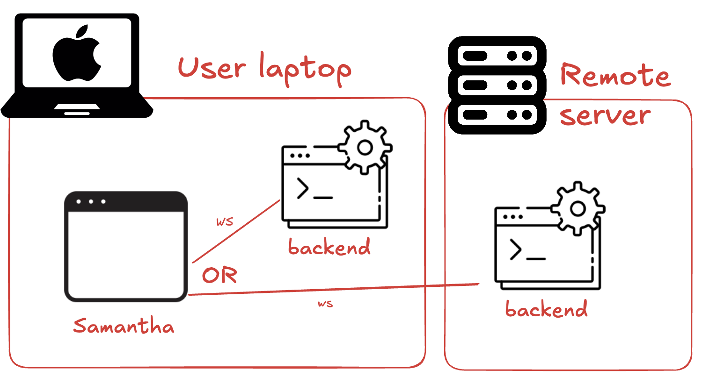
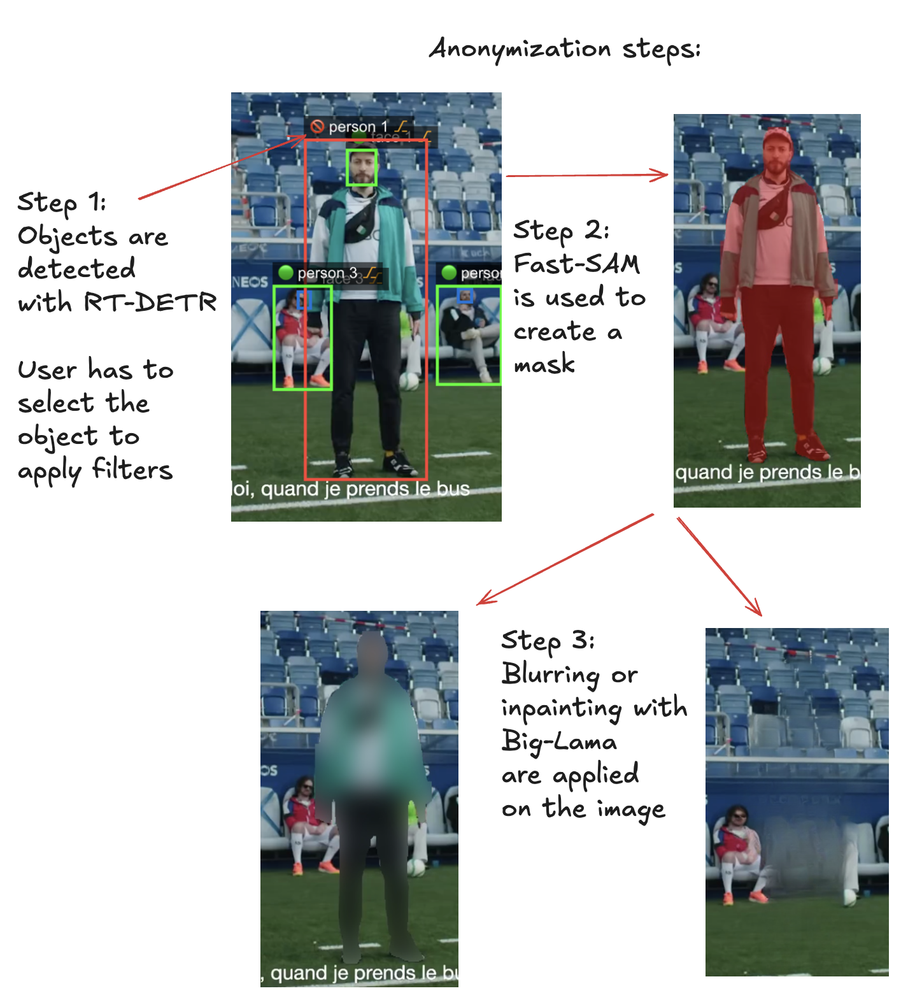

# Report CAS-ADS 24-25

## 1. Introduction

In recent years, the use of video recordings in educational contexts has become increasingly common. Videos are captured for teacher training, classroom observation, analysis of student behavior, and a wide range of pedagogical and research purposes. These recordings often contain personally identifiable information, such as the faces of students and teachers, voices, or background details that can reveal identity. As a result, their use is heavily regulated and subject to ethical constraints.

Despite the growing availability of video data, teachers and educational researchers face significant challenges in using this material. Many educators record valuable content that they ultimately cannot exploit — not because of a lack of educational relevance, but because of legal and ethical concerns related to privacy. Consent is a fragile foundation: parents or legal guardians can revoke permission to use a video at any time, and when this happens, the project may be jeopardized or entire recordings may have to be discarded. This fragility makes it extremely difficult to build sustainable long-term video-based projects or datasets.

Moreover, manual anonymization is labor-intensive and technically complex, and most educators do not have the time, tools, or expertise to do it reliably. Commercial solutions, when available, are often not adapted to the specific needs of academic environments — they may be costly, closed-source, or too generic. As a result, teachers are left with tons of valuable but unusable video data, constrained by their responsibility to protect personal data and comply with strict data protection laws such as the General Data Protection Regulation (GDPR) and the Swiss Federal Act on Data Protection (FADP).

This report presents a solution to this pressing need: a lightweight, transparent, and freely available video anonymization tool designed specifically for educators. Developed at the University of Teacher Education, Vaud (HEP Vaud), this software empowers teachers and researchers to anonymize video content easily and securely. It ensures that private informations such as facial data is removed or pseudonymized, thereby making videos reusable even if consent is later withdrawn, and opening new possibilities for ethical educational research and practice.

## 2. Theoretical Foundations
The anonymization of video data in educational settings involves complex challenges at the intersection of technology, ethics, and law. This chapter provides the theoretical background necessary to understand the importance and complexity of anonymizing personally identifiable information in audiovisual material. It introduces key definitions, discusses the legal and ethical frameworks guiding anonymization practices, and highlights the technical difficulties involved in automating these processes.

### 2.1 What is Video Anonymization?
Video anonymization refers to the process of modifying video content in a way that removes or conceals information that can be used to identify individuals [1]. This typically includes:

-	Faces: The most common biometric identifier in video.
-	Voices: Can also reveal identity and must be anonymized in some contexts.
-	Background elements: Posters, screens, or badges that might show names, school names, or personal details.
- 	Text overlays: Subtitles, annotations, or names displayed on screen.

The goal is to protect the privacy of individuals captured in video footage without significantly degrading the usability of the content for educational or research purposes. We will only focus on faces and common objects in this project. 

A crucial distinction must be made between:
- Anonymization: The irreversible removal of identifying data such that individuals can no longer be identified by any means reasonably likely to be used.
- Pseudonymization: The replacement of identifying data with pseudonyms or placeholders, where the original data is stored separately and can be re-identified under certain conditions.

In this project, face anonymization via blurring or masking is considered a form of pseudonymization, especially if the raw footage is preserved. For complete anonymization, the original data must be deleted or made inaccessible.

### 2.2 Ethical and Legal Considerations
The ethical handling of video data is especially important in educational contexts, where recordings often involve minors, teachers, or vulnerable populations. Even when legal requirements are met, ethical issues may persist regarding informed consent, purpose limitation, and the right to withdraw participation.

Two major legal frameworks govern the use and processing of personal data in Switzerland and Europe :

General Data Protection Regulation (GDPR) (EU) [1]:
- Defines video data containing identifiable persons as personal data.
- Requires informed and explicit consent before processing.
- Grants the right to withdraw consent at any time.
- Encourages privacy by design and privacy by default.

Swiss Federal Act on Data Protection (FADP) [2]:
- Aligns with GDPR in many aspects.
- Requires proportionality and purpose limitation in data collection.
- Grants individuals the right to access, correct, or demand the deletion of their data.	

Educational institutions must go beyond legal compliance and uphold ethical principles such as [5]:

- Respect for autonomy: Individuals must be informed and able to make decisions about their data.
- Data minimization: Only collect what is necessary.
- Transparency: Inform data subjects clearly about data use.
- Accountability: Keep records of consent and anonymization procedures.

In research, ethics boards often refuse or limit the use of video data that has not been properly anonymized, especially when it involves children. Consent withdrawal by a single participant can force the exclusion of entire video datasets. A reliable anonymization tool mitigates this risk and ensures research continuity.

### 2.3 Technical Challenges

Despite its importance, video anonymization remains a technically complex task. Automating the process requires overcoming several challenges [3][4]:

**Dynamic Elements**

Unlike static images, video frames contain:
- Moving faces that change in position, lighting, orientation, and size.
- Occlusions (students turning, hands covering faces).
- Multiple people entering and leaving the frame.

Robust anonymization must detect all faces across all frames, even in difficult conditions.

**Anonymization Quality vs. Data Usability**

Anonymizing video comes with trade-offs:
- Too much blurring can make pedagogical analysis (tudent reactions or classroom behavior) impossible.
- Too little blurring may not sufficiently protect privacy.

The ideal solution strikes a balance between privacy protection and educational usefulness, with adjustable parameters.

**Real-Time Performance**

In practice, teachers or researchers may need to anonymize long videos quickly. The anonymization system must:
- Run on standard hardware (laptops, desktops)
- Process large video files without excessive delay
- Be easy to use with minimal technical knowledge

These constraints informed the technical choices in this project, including the selection of a real-time capable face detection model and the use of efficient video processing libraries.

### 2.4 Conclusion

An effective anonymization tool must address a wide range of ethical, legal, and technical challenges. In education, the stakes are particularly high: without anonymization, valuable video data may remain locked away, unusable due to privacy concerns. By grounding the tool in these theoretical foundations, this project ensures not only technical functionality but also alignment with the responsibilities and values of educational institutions.

# 3. Face Detection with RT-DETR

In this chapter, we detail the process of selecting, adapting, and training a deep learning model for the purpose of automatic face detection in video anonymization. This process was central to the development of our anonymization tool. It involved overcoming several hardware, dataset, and performance constraints to produce a model that performs reliably in real-world educational settings.

## 3.1 Why Face Detection Is Essential

In any anonymization pipeline involving video, the first and most critical step is accurate detection of personally identifiable information (PII). Among all types of PII, faces are the most prominent and sensitive, as they allow for direct identification of individuals. In educational contexts, this is especially important given that videos often contain footage of minors or teachers in classrooms.

A reliable face detector ensures that all faces appearing in video frames are located precisely. This enables downstream anonymization operations, such as blurring, pixelation, inapinting or masking, to be applied effectively. If detection fails or is inaccurate, anonymization cannot be guaranteed, potentially leading to privacy breaches or non-compliance with data protection laws.

For this reason, we decided to build a custom-trained face detection model, tailored for high accuracy in diverse environments.

## 3.2 Model Selection: RT-DETR-X

The selection of the object detection architecture was guided by two hard constraints:
- The model must run on standard Apple M1 MacBook Airs used by university staff (no discrete GPUs).
- The model must also be trainable and deployable on CUDA-compatible computers with NVIDIA GPUs.

After evaluating several object detection frameworks, two architectures stood out for their support of both CUDA and Apple’s Metal Performance Shaders (MPS):
- YOLO (You Only Look Once): a popular family of object detectors, known for speed and ease of deployment.
- RT-DETR (Real-Time Detection Transformer): a newer transformer-based model offering competitive accuracy and speed, especially on complex scenes.

While YOLO models are widely used and optimized, RT-DETR demonstrated superior accuracy in scenarios involving occlusions [6], dense scenes, and varied lighting conditions, which are common in real-world classroom footage. RT-DETR also integrates well with the Ultralytics framework, enabling consistent workflows across platforms.

We selected RT-DETR-X, the extended and more capable variant of RT-DETR, as the base model for this project.

RT-DETR (Real-Time Detection Transformer) is a recent family of object detectors that combines the transformer architecture, known for its effectiveness in capturing global context, with a real-time inference pipeline. Unlike traditional CNN-based detectors that use anchor boxes and post-processing steps like Non-Maximum Suppression (NMS), RT-DETR adopts a set-based detection approach. This means it directly predicts object locations and classifications without requiring multiple proposals or region refinement. As a result, RT-DETR tends to produce fewer false positives and better handles overlapping objects [6].

One key advantage of RT-DETR over YOLO is its performance in complex scenes. In cluttered classroom environments with many overlapping objects, RT-DETR maintains a higher detection quality. It is also more stable when objects are partially occluded or vary in size and aspect ratio. Additionally, RT-DETR benefits from transformer-based attention mechanisms that allow it to reason about object relationships more effectively than YOLO.

However, RT-DETR also comes with disadvantages. It is computationally heavier than YOLO, leading to longer inference times and more memory usage. It was chosen because the goal was to prioritize detection accuracy in difficult conditions rather than pure speed. The additional computational cost was acceptable given the model's compatibility with both CUDA and Apple MPS, and the option to run inference remotely when needed.

## 3.3 Dataset: WIDER Face
The WIDER Face dataset [7] was chosen for fine-tuning the RT-DETR-X model. 
It is widely regarded as a benchmark for evaluating face detection algorithms, due to its diversity and difficulty:
- Over 132,000 images and 393,000 annotated faces.
- Faces appear in various conditions: extreme poses, occlusions, crowded scenes, low resolution, and non-frontal angles.
- Divided into training, validation, and test sets.

This makes WIDER Face particularly suited for training a face detector that needs to generalize to diverse educational environments, such as group activities, low lighting, or partially visible students.

However, WIDER Face is not natively formatted for training with RT-DETR or Ultralytics. Therefore, we had to preprocess the data accordingly.

WIDER Face provides its annotations in a custom .txt format that lists bounding box coordinates for faces within each image. 
To use these annotations with RT-DETR via the Ultralytics interface, the following steps were necessary:

Custom Conversion Scripts:
- We wrote two scripts: train2yolo.py and val2yolo.py.
- These scripts parsed the WIDER Face annotation files and generated one YOLO-style .txt file per image, listing bounding boxes in normalized coordinates.

Dataset Organization:
- Images and labels were structured into folders following the YOLO convention: images/train, labels/train, images/val, labels/val.

Configuration File:
- A wider.yaml file was created to define the dataset class (face), training/validation image paths, and number of classes.

This preprocessing ensured seamless compatibility with the Ultralytics RT-DETR training pipeline.

## 3.4 Training the Model
Due to the limitations of local hardware, training was not possible on a MacBook Air. We rented a cloud server via Lambda Labs, equipped with a NVIDIA GH200 GPU and 96 GB of GPU RAM. Despite this powerful setup, training a transformer-based model like RT-DETR-X on a large dataset remained computationally expensive.

**Initial Strategy: Multi-Task Training**

We initially attempted to combine COCO and WIDER Face datasets, training RT-DETR-X to detect both the original 80 COCO classes and an additional “face” class. However, this approach failed due to:
- Memory constraints: Batch sizes had to be reduced drastically, slowing training dramatically.
- Data imbalance: WIDER Face provides far more images per class than COCO, leading to catastrophic forgetting. The model began to ignore the COCO classes and focused almost exclusively on faces.

**Final Strategy: Dedicated Face Model**

To resolve this, we retrained RT-DETR-X exclusively on WIDER Face, resulting in a dedicated face detection model. The training notebook, train-RT-DETR-X-Face.ipynb, defines the process:
- Epochs: 300
- Image size: 640×640
- Batch size: 8 
- AMP: Enabled for mixed-precision speedup
- Optimizer: Default Ultralytics settings

The training process was monitored with loss curves and validation metrics.

**Results**

The model achieved:
- mAP@0.5 = 0.579 on the WIDER Face validation set.

While this score is lower than state-of-the-art models like RetinaFace [8] (which reach ~0.9 mAP@0.5), it is acceptable for anonymization purposes. Additional improvements (e.g.hyperparameter tuning, longer training, better augmentation) could improve performance, but were not feasible due to cost and time constraints.

## 3.5 Deployment architecture

Due to the limitations encountered during multi-task training, we adopted a dual-model architecture:
- One default RT-DETR-X model pre-trained on COCO for general object detection.
- One fine-tuned RT-DETR-X model for face detection only, trained on WIDER Face.

At runtime, both models can be used sequentially or selectively:
- For anonymization, only the face detector is needed.
- For educational analysis, the COCO model can provide additional contextual detections.

Both models are lightweight enough to run on Apple Silicon using MPS acceleration, making the application usable on standard university hardware.

## 3.7 Conclusion

This chapter has shown the step-by-step process used to build a custom face detection model tailored for educational video anonymization. By selecting RT-DETR-X for its balance of speed and accuracy, and by training it on the WIDER Face dataset, we developed a robust detector capable of operating in real-time on constrained hardware. Despite the computational cost and training challenges, the resulting model is fit for purpose and can be seamlessly integrated into the anonymization pipeline.

# 4. Application Development

The anonymization application developed for this project is composed of two main components: a frontend responsible for user interaction, and a backend that handles all computational tasks, including video analysis and anonymization. This architecture was chosen to balance flexibility, performance, and usability, particularly in environments where computational resources vary significantly.

This application is still under active development and is not yet ready for deployment. Several parts of the system are still being stabilized, and the installation process currently requires technical knowledge. The final goal of the project is to provide a fully packaged application that can be easily executed by end-users on any major operating system (macOS, Windows, Linux). Once the core functionality is complete and tested, executables will be created and distributed to allow one-click launch without requiring manual installation or setup.

## 4.1 Architecture overview

**Frontend (Electron app with Quasar Framework and Typescript)**

The frontend is developed using Electron and the Quasar Framework (Vue.js) using Typescipt. It provides an intuitive and responsive user interface through which users can:
- Upload and preview video files
- Define detection and anonymization settings
- Select specific objects and regions to anonymize
- Monitor the progress of detection and processing tasks

**Backend (Python)**

The backend is built in Python, using:
- PyTorch for model inference
- OpenCV and ffmpeg for video decoding and encoding
- Additional libraries for object tracking and mask-based anonymization

The backend is responsible for:
- Object detection
- Video frame extraction and processing
- Anonymization using segmentation and inpainting
- Rebuilding the final anonymized video

**Communication via WebSocket**

Frontend and backend components communicate using WebSocket protocol, which allows for real-time, bidirectional data exchange. This enables:
- Continuous feedback during detection and processing
- Dynamic object preview and annotation
- Asynchronous task handling

This separation also offers deployment flexibility:
- The backend can run locally on powerful machines (e.g., M1/M2 laptops with sufficient RAM).
- It can also run remotely on a dedicated server, enabling lightweight clients to access advanced processing.

## 4.2 Anonymization workflow

The anonymization process is structured as a step-by-step pipeline that balances automation and human validation to ensure both privacy and usability of the anonymized content. It involves a combination of object detection, manual review, and pixel-level masking, using deep learning models optimized for performance and compatibility with common hardware.

**Step 1: Project Initialization and Video Selection**

The process begins when the user creates a new project. Each project is associated with a specific video file that contains potentially sensitive content. The video is loaded into the application, and the workspace is initialized with all necessary resources, including pretrained models and tracking utilities.

***Step 2: Video Trimming***

To optimize processing time and limit anonymization to only necessary segments, the user is prompted to trim the video. This step allows selecting a smaller, relevant portion of the video timeline that actually requires anonymization. It is especially useful when only a short classroom sequence contains identifiable individuals.

***Step 3: Object Detection***

Once trimming is complete, the backend performs object detection on every frame of the trimmed video. Two RT-DETR models are used in parallel:
- **RT-DETR-X (COCO pretrained)**: Detects general object classes.
- **RT-DETR-X (WIDER Face fine-tuned)**: Detects human faces with high accuracy.

Each frame is processed, and all detected objects are associated with bounding boxes. A tracking system (ByteTrack) is also applied to follow each detected object over time, assigning consistent IDs to simplify the user's review process.

***Step 4: Object Review and Selection***

The user then enters the review phase. All detected objects are displayed on the video frames in the interface. The user is required to go through each frame—or use tracked IDs—to:
- Select the objects they wish to anonymize.
- Optionally mark objects to keep unchanged.

This manual step ensures that only relevant and ethically sensitive elements are targeted for anonymization, while preserving valuable pedagogical content such as whiteboards, gestures, or interactions that are not privacy-critical.

***Step 5: Anonymization***

After the selection phase, the anonymization process begins. The backend processes the video frame by frame, and for each object marked for anonymization, the following steps are executed:

***5.1 Mask Generation with FastSAM-X***
For every bounding box, a binary segmentation mask is generated using **FastSAM-X**. This model provides a more precise mask than a simple rectangle, allowing pixel-accurate anonymization. FastSAM-X is selected for its compatibility with Apple Silicon and its ability to run in real time.

***5.2 Applying the Anonymization Filter***

Depending on the user's chosen method, one of two filters is applied:

- **Blur**: A Gaussian blur is applied to the region defined by the FastSAM mask. This method is fast and preserves contextual cues in the video, while removing facial or object details.
  
- **Inpaint**: For complete removal, the masked region is passed to **Big-Lama**, a state-of-the-art inpainting model. Big-Lama fills the area with visually consistent background, effectively erasing the object from the image. It is also Apple Silicon–compatible, ensuring local performance.

***Step 6: Video Reconstruction***

Once all frames are anonymized, the backend reassembles them into a complete video using ffmpeg. The final output preserves the original audio and frame rate, and is exported to the project folder. The user can then review and download the anonymized version.

⸻

## 5. Evaluation
The application developed in this project has been successfully tested in several typical educational scenarios. It achieves its main goal: allowing educators and researchers to easily anonymize videos containing sensitive content such as student faces or personal objects. This section evaluates the performance, limitations, and usability of the tool based on real-world testing.

### 5.1 Detection Performance

The dual-model detection setup—using RT-DETR for general objects and RT-DETR-X for faces—delivers reliable results on a wide range of scenes. In simple scenes, detection accuracy is high and consistent. However, the detection system exhibits some weaknesses in complex classroom environments, particularly when:
- Faces are partially occluded or viewed from extreme angles.
- People move quickly or enter and exit the frame rapidly.
- The background is visually cluttered or highly dynamic.

In such conditions, the model may miss detections or introduce false positives. While this is acceptable for many anonymization cases, future versions may require additional refinement or ensemble methods to improve robustness.

### 5.2 Tracking and Object Consistency

The use of ByteTrack enables consistent object tracking across frames, allowing users to select and anonymize tracked entities efficiently. However, the tracking is not perfect and may:
- Merge two different people into a single ID when paths cross.
- Lose track of fast-moving individuals.

To address this, a “split” function is planned to allow users to manually separate object identities when tracking fails.

### 5.3 Mask Precision and Visual Quality

The masking system, based on FastSAM-X, provides fast and hardware-compatible segmentation masks from bounding boxes. However, it is not always precise. In particular:
- Masks may be too loose or too tight, especially in crowded or occluded scenes.
- Incomplete coverage may result in visible traces of the original object after processing.

For high-privacy use cases, this can be problematic. While the blur mode is more tolerant of mask imprecision, the inpainting mode using Big-Lama may still produce ghosting artifacts, especially in busy backgrounds or high-contrast areas.

### 5.4 Manual Intervention Requirements

In some cases, objects or regions that should be anonymized are not detected at all by the system. To compensate for this, a manual annotation tool is planned. This tool will allow users to draw bounding boxes or masks directly on frames where detection has failed, ensuring complete coverage.

### 5.5 Performance and Usability

From a usability standpoint, the application is already highly functional and easy to use. The step-by-step interface guides users through the anonymization process clearly. User testing with non-technical educators showed that the UI is intuitive and the overall workflow is understandable without needing technical documentation.

Performance-wise:
- Detection and tracking are reasonably fast on Apple Silicon devices.
- Anonymization is significantly slower, especially when using Big-Lama for inpainting. On long videos or lower-spec machines, this may lead to high processing times.

Optimizations such as parallel processing, asynchronous queuing, and frame resolution downscaling may be explored to improve speed.

### 5.6 Summary

In summary, the tool performs well in controlled and semi-complex scenarios and offers a practical anonymization solution for education. Its current limitations—especially in mask quality, tracking consistency, and processing speed—are acknowledged and are being addressed in the next development phases. Despite these, the application already provides meaningful utility to its target users and has laid a solid foundation for future improvements.

# 6. Conclusion
This project set out to address a concrete and pressing issue in the field of educational research and teacher training: the ethical, legal, and practical challenges of using video data that contains personally identifiable information. Through the development of a specialized video anonymization tool, we demonstrated that it is possible to empower educators with accessible and efficient technology that upholds privacy and complies with strict data protection laws.

The contributions of this work include:
- A dual-model anonymization pipeline based on RT-DETR-X and fine-tuned face detection models.
- A user-friendly application architecture that supports real-time detection, manual review, and pixel-level anonymization using advanced models such as FastSAM-X and Big-Lama.
- A modular frontend/backend system that runs on both local Apple Silicon devices and remote servers.

While the tool is still under development, initial results are promising. The application works well in typical classroom scenarios, and its intuitive interface has been positively received by educators. Nonetheless, important challenges remain. Detection and tracking could be improved in complex scenes, masks can be imprecise, and the anonymization process—especially inpainting—can be slow. The development roadmap includes implementing manual anonymization tools, optimizing performance, and packaging the app for easy deployment across platforms.

This tool represents a concrete step toward responsible, open, and scalable use of video data in education. By combining cutting-edge machine learning models with real-world constraints and ethical priorities, we contribute to a more privacy-conscious academic ecosystem. Once stable, this software will be released as open source, enabling wider adoption and continued improvement by the educational and research community.

# 7. References

[1]: https://egonym.com/blog/best-video-anonymization-software-for-privacy-compliance
[2]: https://forscenter.ch/wp-content/uploads/2020/06/kleinerstam_fg11_anonymisation1_v1.0-1.pdf
[3]: https://datafromsky.com/news/dynamic-anonymization-anonymized-video-streaming
[4]: https://www.immuta.com/blog/data-anonymization-techniques
[5]: https://arxiv.org/abs/1710.06881
[6]: https://arxiv.org/pdf/2304.08069
[7]: http://shuoyang1213.me/WIDERFACE/
[8]: https://github.com/serengil/retinaface
[9]: https://docs.ultralytics.com/fr/models/fast-sam/
[10]: https://github.com/advimman/lama